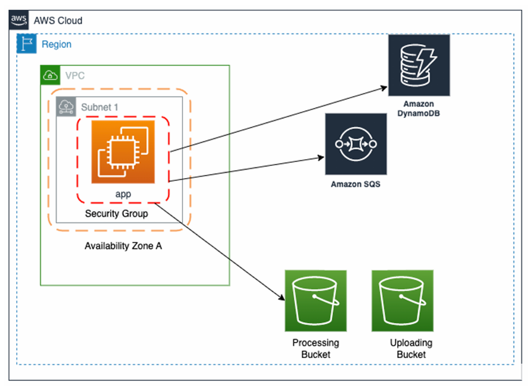
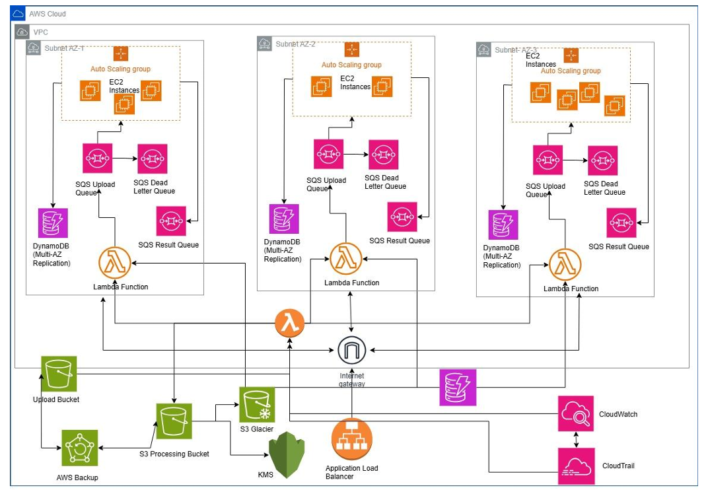
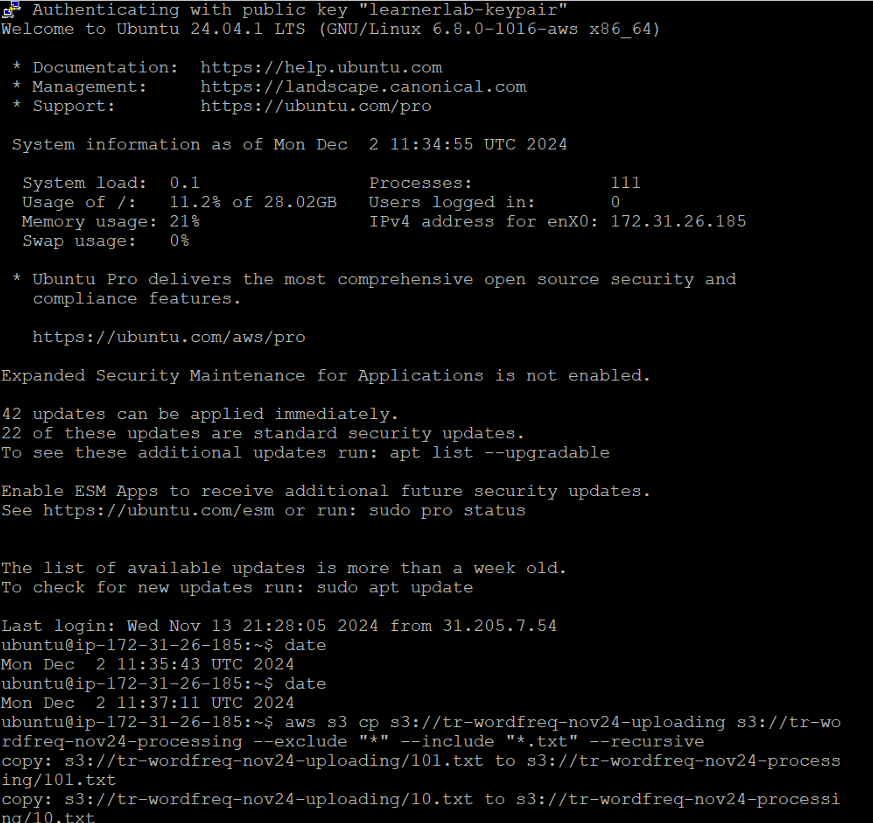
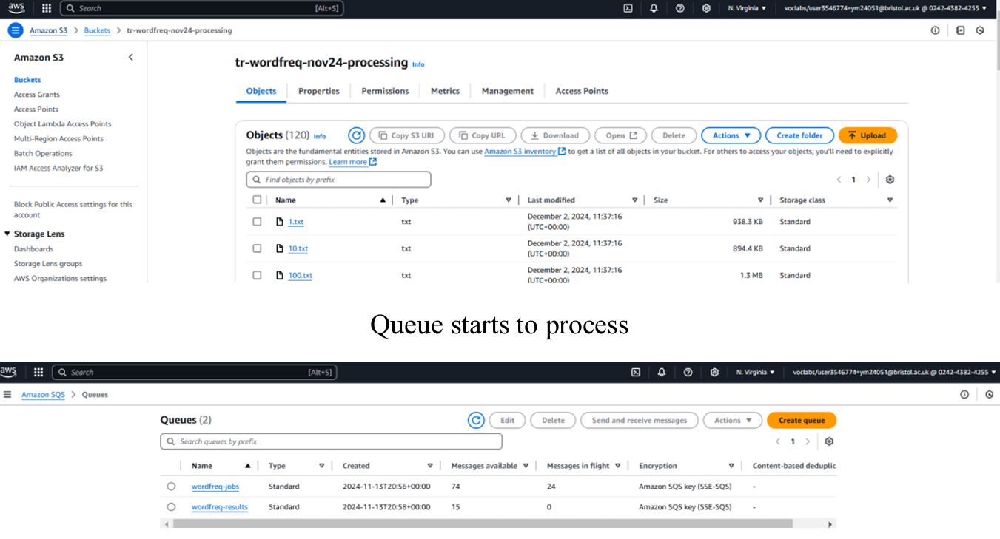
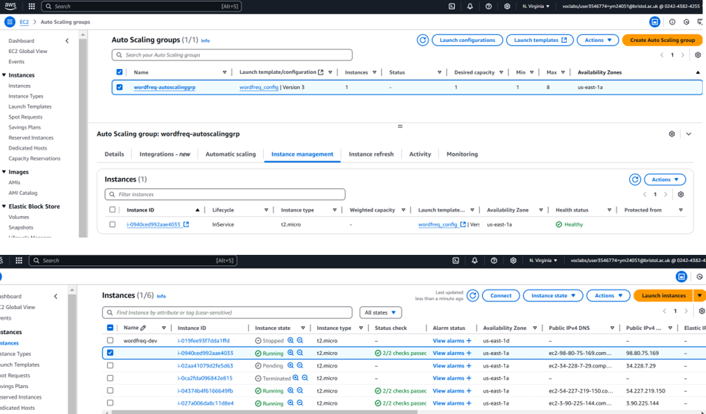
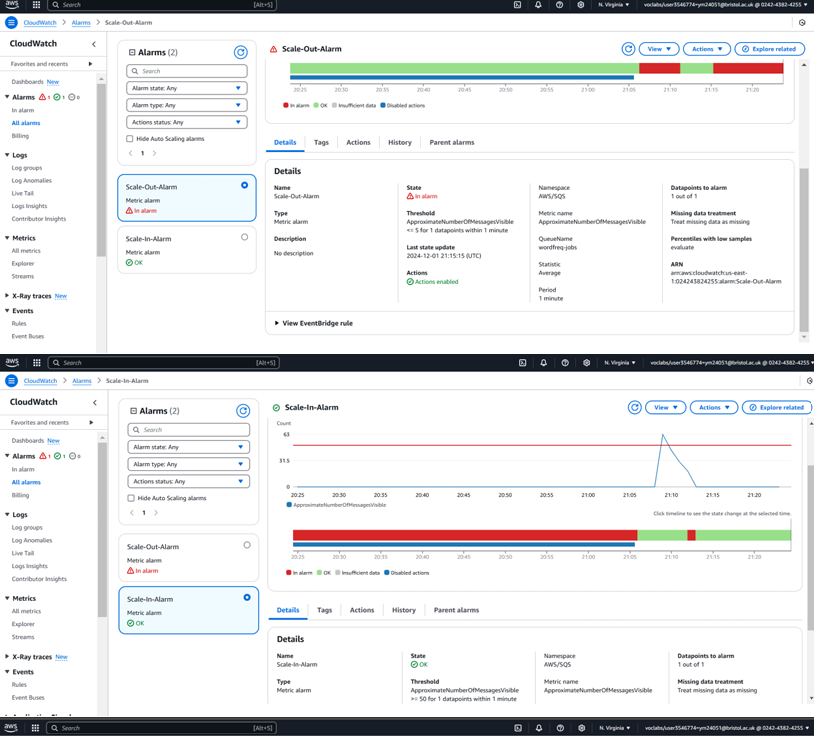

# AWS WordFreq Project: Architecting and Scaling a Cloud-Native Text Analyzer

This repository contains the implementation and documentation for the **WordFreq Application**, a scalable, cloud-native text analysis pipeline developed for the **Large-Scale Data Engineering (LSDE)** coursework at the **University of Bristol**.

---

## Project Overview

The WordFreq application allows users to upload `.txt` files and automatically analyzes each file to determine the **top 10 most frequent words**. The system leverages a fully event-driven AWS architecture using services like EC2, S3, SQS, DynamoDB, Lambda, IAM, CloudWatch, and Auto Scaling.

The project demonstrates how to build a **resilient, cost-efficient, and scalable** serverless architecture using AWS services for real-time data ingestion, processing, and storage.

---

## Key Features

- Automated file ingestion via Amazon S3 event notifications
- Server-based processing using EC2 with GoLang worker service
- Queue-based decoupling using SQS (Jobs + Results queues)
- Output persistence in DynamoDB
- Multi-stage Auto Scaling with performance tuning
- Monitoring and alerting using CloudWatch Alarms and Metrics
- Enhanced security and access control via IAM, KMS, and VPC
- Long-term storage with S3 Glacier and AWS Backup

---

## AWS Services Used

- **Amazon EC2**: Processing instance(s) for text analysis
- **Amazon S3**: Upload and processing buckets
- **Amazon SQS**: Messaging queues to handle job distribution
- **Amazon DynamoDB**: NoSQL database to store results
- **AWS Lambda**: Event-based automation and backup triggers
- **IAM & KMS**: Secure access and encryption
- **CloudWatch**: Monitoring, alarms, and auto-scaling triggers
- **S3 Glacier & AWS Backup**: Long-term archival and disaster recovery

---

## Setup & Installation

Full setup instructions, from provisioning AWS resources to running the application, are included in [`setup.txt`](./setup.txt).  
This includes:
- EC2 instance setup and configuration
- Installing Go and AWS CLI
- S3 and SQS provisioning
- IAM and auto-scaling setup
- Uploading sample `.txt` files and triggering the pipeline

---

## Architecture & Screenshots

### Standard Architecture (Initial Setup)


### Optimised Architecture (Final Version)


### AWS Console Screenshots

**S3 Buckets**


**SQS Job Queue**


**EC2 Auto Scaling**


**DynamoDB Result Table**


**CloudWatch Queue Metric**


---

## Optimization & Testing

Four optimization iterations were carried out using different EC2 instance types and scaling strategies:

| Iteration | Instance Type | Scaling Method    | Processing Time |
|-----------|----------------|-------------------|------------------|
| 1         | t2.micro       | Basic Scaling      | 12m 50s          |
| 2         | t2.micro       | Threshold Tuning   | 6m 43s           |
| 3         | t3.large       | Step Scaling       | 4m 34s           |
| 4         | c5.large       | Step Scaling       | 3m 38s           |

---

## Repository Structure

```
wordfreq-aws-lsde/
├── README.md
├── setup.txt
├── reports/
│   ├── task1_architecture.pdf
│   └── task2_wordfreq_project.pdf
├── architecture/
│   ├── wordfreq-architecture-before.png
│   └── wordfreq-architecture-after.png
├── screenshots/
│   ├── s3-buckets.png
│   ├── sqs-job-queue.png
│   ├── dynamodb-table.png
│   ├── ec2-auto-scaling.png
│   └── cloudwatch-metrics.png
├── code/
│   └── lsde-wordfreq-app/
├── data/
│   └── sample-txt-files/
```

---

## Author

**Thrisha Rajkumar**  
University of Bristol – EMATM0051 Large Scale Data Engineering  
AWS Academy Learner Lab Project

---

## License

This repository is intended for educational use and evaluation as part of the LSDE coursework.  
All architecture, configuration, and implementation details are owned by the author. Do not redistribute without permission.
